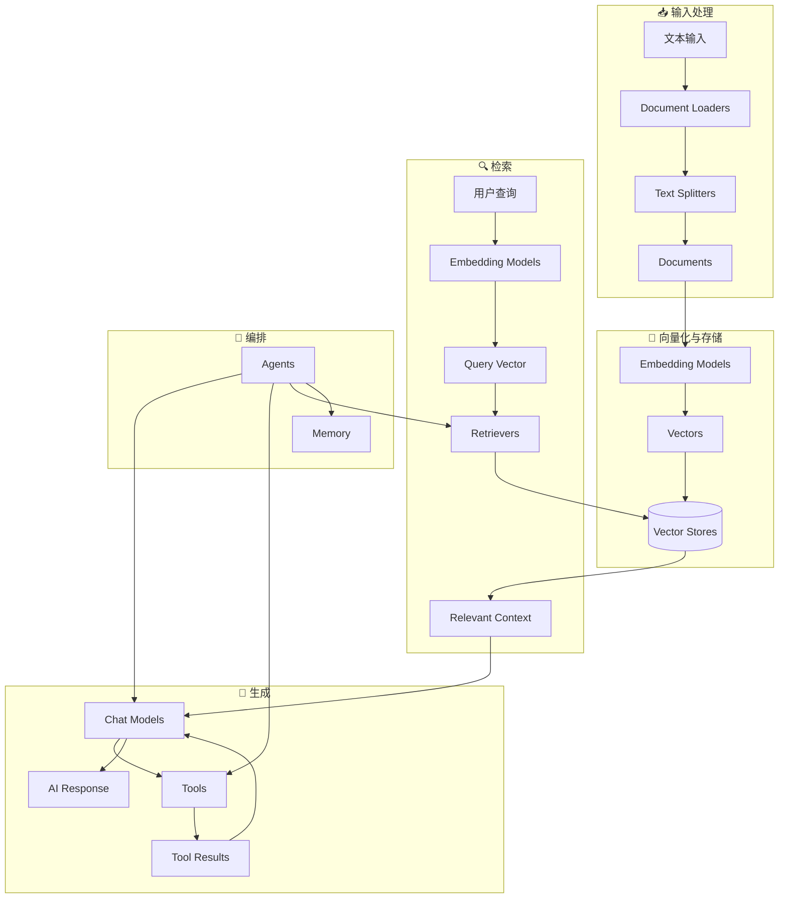

# 第16章 LangChain 组件架构与多 Agent 模式

> 预计学习时间：1 小时

## 🎯 本章目标

学习完本章，你将能够：
- 理解 LangChain 的核心组件生态系统
- 实现 Router 模式（多源知识路由）
- 实现 Handoffs 模式（步骤流转）
- 构建带安全校验的 SQL Agent

## 📋 前置知识

> 如果你还没有学习以下内容，建议先完成：
> - [第11章 子代理系统](./11-subagents.md) —— 了解多 Agent 协作的基本概念
> - [第6章 中间件系统](./06-middleware.md) —— 了解中间件的路由拦截机制

## 💡 核心概念

### 16.1 LangChain 组件生态系统

LangChain 的组件生态系统可以分为五大模块，它们按照数据处理流程依次排列：从输入处理开始，经过向量化和存储、检索，最终到生成和编排。下面的架构图展示了这些模块之间的协作关系：



**各组件的作用（按流程顺序排列说明）：**

| 组件 | 功能 | 类似概念 |
|------|------|---------|
| **Document Loaders** | 从各种源加载文档 | ETL 的 Extract |
| **Text Splitters** | 将文档切分为片段 | 分块处理 |
| **Embedding Models** | 将文本转为向量 | 特征提取 |
| **Vector Stores** | 存储和搜索向量 | 搜索引擎 |
| **Retrievers** | 根据查询检索相关文档 | 信息检索 |
| **Chat Models** | 生成对话回复 | LLM |
| **Tools** | Agent 可调用的外部能力 | 函数 |
| **Memory** | 跨对话持久化信息 | 数据库 |
| **Agents** | 编排以上组件完成任务 | 协调者 |

**组件工作流程说明：** 当用户提交一个自然语言问题时，Document Loaders 首先从 PDF、网页或数据库中加载相关的原始文档资料，然后 Text Splitters 将这些长文档切分为适合处理的小片段。接下来 Embedding Models 将这些文本片段转换为向量（即数值表示形式），并存入 Vector Stores 中进行快速索引。当用户发起查询时，Retrievers 在向量库中搜索最相关的片段，最后 Chat Models 结合这些片段和用户的问题生成最终的回答返回给用户。

### 16.2 Router 模式（多源知识路由）

Router 模式适用于**需要从多个数据源查询信息**的场景，如同时查询 GitHub 代码库、Notion 文档和 Slack 聊天记录。它的核心思想是：由一个中央路由器（Router）负责分析用户的问题，然后将问题分发给对应领域的专用 Agent，最后通过一个合成器（Synthesizer）将多个来源的结果整合为统一的回答。这种模式解决了"一个 Agent 不可能擅长所有领域"的问题——每个 Agent 只负责自己擅长的数据源，处理结果再由路由器统一合并。

**架构：**

Router 模式的工作流程分为三个步骤：首先，路由器接收用户的查询并判断它属于哪个领域；然后，将查询分发给对应领域的专用 Agent 去执行；最后，合成器收集所有 Agent 的返回结果，将它们整合为一个统一的回答返回给用户。

```
用户查询
    │
    ▼
┌──────────┐
│  Router   │ ← 分类查询，分发到不同 Agent
└────┬─────┘
     │
     ├─────→ GitHub Agent（搜索代码/Issues/PRs）
     ├─────→ Notion Agent（搜索文档）
     └─────→ Slack Agent（搜索消息）
          │
          ▼
┌──────────┐
│  Synthesizer │ ← 整合所有结果
└──────────────┘
```

**完整代码示例：**

```typescript
import { createAgent, tool } from "langchain";
import { StateGraph, START, END, Send } from "@langchain/langgraph";
import { z } from "zod";

// ===== 工具定义 =====
// 定义三个不同数据源的工具：GitHub 代码搜索、Notion 文档搜索、Slack 消息搜索
// 每个工具返回该数据源中与用户查询相关的结果
const searchCode = tool(
  async ({ query }) => `Found code matching '${query}'`,
  {
    name: "search_code",
    description: "Search code in GitHub repositories",
    schema: z.object({ query: z.string() }),
  }
);

const searchIssues = tool(
  async ({ query }) => `Found issues matching '${query}'`,
  {
    name: "search_issues",
    description: "Search GitHub issues",
    schema: z.object({ query: z.string() }),
  }
);

const searchNotion = tool(
  async ({ query }) => `Found docs matching '${query}'`,
  {
    name: "search_notion",
    description: "Search Notion workspace",
    schema: z.object({ query: z.string() }),
  }
);

const searchSlack = tool(
  async ({ query }) => `Found Slack messages matching '${query}'`,
  {
    name: "search_slack",
    description: "Search Slack messages",
    schema: z.object({ query: z.string() }),
  }
);

// ===== 专用 Agent =====
const githubAgent = createAgent({
  model: "anthropic:claude-sonnet-4-6",
  tools: [searchCode, searchIssues],
  systemPrompt: "You are a GitHub expert. Search code, issues, and PRs.",
});

const notionAgent = createAgent({
  model: "anthropic:claude-sonnet-4-6",
  tools: [searchNotion],
  systemPrompt: "You are a Notion expert. Search documentation.",
});

const slackAgent = createAgent({
  model: "anthropic:claude-sonnet-4-6",
  tools: [searchSlack],
  systemPrompt: "You are a Slack expert. Search messages and threads.",
});

// ===== State 定义 =====
const RouterState = new StateSchema({
  query: z.string(),
  classifications: z.array(z.object({
    source: z.enum(["github", "notion", "slack"]),
    query: z.string(),
  })),
  results: z.array(z.object({
    source: z.string(),
    result: z.string(),
  })).default([]),
  finalAnswer: z.string(),
});

// ===== Graph 构建 =====
// 分类节点
async function classifyQuery(state: typeof RouterState.State) {
  // 使用 LLM 分类查询
  const classification = {
    classifications: [
      { source: "github" as const, query: `authentication code in ${state.query}` },
      { source: "notion" as const, query: `authentication docs for ${state.query}` },
      { source: "slack" as const, query: `authentication discussion about ${state.query}` },
    ],
  };
  return { classifications: classification.classifications };
}

// 并行分发
function routeToAgents(state: typeof RouterState.State) {
  return state.classifications.map((c) => {
    const agentMap = { github: githubAgent, notion: notionAgent, slack: slackAgent };
    return new Send(c.source, { query: c.query, source: c.source });
  });
}

// 整合结果
async function synthesizeResults(state: typeof RouterState.State) {
  const combined = state.results.map(r => `## ${r.source}\n${r.result}`).join("\n\n");
  // 使用 LLM 整合
  return { finalAnswer: `## 综合报告\n\n${combined}` };
}

// 构建图
const workflow = new StateGraph(RouterState)
  .addNode("classifier", classifyQuery)
  .addNode("github", async (state) => ({
    results: [{ source: "github", result: "Found 3 items..." }],
  }))
  .addNode("notion", async (state) => ({
    results: [{ source: "notion", result: "Found 2 docs..." }],
  }))
  .addNode("slack", async (state) => ({
    results: [{ source: "slack", result: "Found 5 messages..." }],
  }))
  .addNode("synthesizer", synthesizeResults)
  .addEdge(START, "classifier")
  .addConditionalEdges("classifier", routeToAgents, ["github", "notion", "slack"])
  .addEdge("github", "synthesizer")
  .addEdge("notion", "synthesizer")
  .addEdge("slack", "synthesizer")
  .addEdge("synthesizer", END)
  .compile();
```

### 16.3 Handoffs 模式（步骤流转）

Handoffs 模式适用于**需要按固定步骤顺序处理**的业务流程场景，一个典型的例子是客服系统的工单流转——一个新工单到达后，需要先经过分类（Triage）步骤确定问题类型，然后由诊断（Diagnosis）步骤分析问题的根本原因，最后由解决（Resolution）步骤给出具体的处理方案。每个步骤由一个专门的 Agent 负责，前一步骤的输出作为后一步骤的输入，直到流程结束。

下面的代码实现了一个完整的客服工单流转系统，包括状态定义、步骤配置和中间件路由：

```typescript
import { createAgent, createMiddleware, tool } from "langchain";
import { Command, MemorySaver, StateSchema } from "@langchain/langgraph";
import { z } from "zod";

// 定义步骤状态
const SupportState = new StateSchema({
  currentStep: z.string().default("triage"),
  issueType: z.string().optional(),
  warrantyStatus: z.string().optional(),
  resolution: z.string().optional(),
});

// 步骤配置
// 每个步骤包含：提示词模板、需要满足的前置条件、以及下一步的名称
const STEP_CONFIG: Record<string, {
  prompt: string;
  tools: any[];
  requires: string[];
  next: string;
}> = {
  triage: {
    prompt: `收集客户信息：
    - 客户姓名和联系方式
    - 问题类型
    - 购买日期`,
    tools: [],
    requires: [],
    next: "diagnosis",
  },
  diagnosis: {
    prompt: `根据问题类型进行诊断。
    使用诊断工具检查问题原因。`,
    tools: [runDiagnostic],
    requires: ["issueType"],
    next: "resolution",
  },
  resolution: {
    prompt: `根据诊断结果提供解决方案。
    如果需要升级，使用 escalate 工具。`,
    tools: [provideSolution, escalate],
    requires: ["warrantyStatus"],
    next: "completed",
  },
};

// 步骤中间件
const applyStepMiddleware = createMiddleware({
  name: "applyStep",
  wrapModelCall: async (request, handler) => {
    const currentStep = request.state.currentStep || "triage";
    const config = STEP_CONFIG[currentStep];

    if (!config) throw new Error(`Unknown step: ${currentStep}`);

    // 验证必备状态
    for (const key of config.requires) {
      if (request.state[key] === undefined) {
        throw new Error(`${key} must be set before step ${currentStep}`);
      }
    }

    return handler({
      ...request,
      systemPrompt: config.prompt,
      tools: config.tools,
    });
  },
});

const agent = createAgent({
  model: "anthropic:claude-sonnet-4-6",
  middleware: [applyStepMiddleware],
  checkpointer: new MemorySaver(),
});
```

### 16.4 SQL Agent（完整实现）

SQL Agent 是一个将自然语言转换为 SQL 查询，并在数据库中安全执行的 Agent。它的核心挑战在于：既要准确理解用户的自然语言意图并生成正确的 SQL 查询语句，又要确保生成的 SQL 不会对数据库造成任何损害。下面是一个带安全校验的生产级 SQL 查询 Agent。它通过正则表达式过滤掉所有非 SELECT 的操作（如 INSERT、UPDATE、DELETE、DROP 等危险操作），并且自动为查询结果添加 LIMIT 限制，防止一次返回过多数据导致前端卡顿：

```typescript
import { createAgent, tool } from "langchain";
import { z } from "zod";
import sqlite3 from "sqlite3";

// ===== 安全校验 =====
// 禁止所有数据修改操作，只允许 SELECT 查询
const DENY_RE = /\b(INSERT|UPDATE|DELETE|ALTER|DROP|CREATE|REPLACE|TRUNCATE)\b/i;
const HAS_LIMIT_RE = /\blimit\b\s+\d+(\s*,\s*\d+)?\s*;?\s*$/i;

function sanitizeSql(q: string): string {
  let query = q.trim().replace(/;+\s*$/g, "");

  // 只允许 SELECT
  if (!query.toLowerCase().startsWith("select")) {
    throw new Error("Only SELECT is allowed");
  }
  // 禁止 DML/DDL
  if (DENY_RE.test(query)) {
    throw new Error("DML/DDL is not permitted");
  }
  // 默认 LIMIT
  if (!HAS_LIMIT_RE.test(query)) {
    query += " LIMIT 5";
  }
  return query;
}

// ===== 数据库查询工具 =====
const executeSql = tool(
  async ({ query }: { query: string }) => {
    const safeQuery = sanitizeSql(query);
    // 执行查询...
    return `[Query Results]\n${safeQuery}`;
  },
  {
    name: "execute_sql",
    description: "Execute a READ-ONLY SQLite SELECT query",
    schema: z.object({
      query: z.string().describe("SELECT query to execute"),
    }),
  }
);

const getSchema = tool(
  async () => {
    return `-- Schema:\nCREATE TABLE users (id INT, name TEXT, email TEXT);`;
  },
  {
    name: "get_schema",
    description: "Get the database schema",
    schema: z.object({}),
  }
);

// ===== SQL Agent =====
export const sqlAgent = createAgent({
  model: "anthropic:claude-sonnet-4-6",
  tools: [executeSql, getSchema],
  systemPrompt: `You are a careful SQL analyst.

  1. First, get the schema to understand the database
  2. Write safe SELECT queries
  3. Always use LIMIT
  4. Only read operations allowed
  5. Explain your queries in plain English`,
});
```

---

## 🔨 实战演练

### 练习 1：构建企业知识库路由器

将 GitHub、Notion 和 Slack 的知识统一查询：

```typescript
// 复用上面的 Router 模式代码
// 配置不同的工具实现

const result = await workflow.invoke({
  query: "How do we handle authentication in our API?",
});
console.log(result.finalAnswer);
```

---

## ⚡ 进阶技巧

### 技巧一：Router 模式中的中间件应用

在 Router 模式中，你可以使用中间件来添加额外的路由逻辑。例如，根据用户的权限级别（admin、editor、viewer）决定使用哪个知识源，或者在路由请求之前进行日志记录和访问权限校验。这让路由系统更加灵活和安全。

### 技巧二：Handoffs 模式的错误处理

在 Handoffs 模式中，多个步骤依次执行，每一步都可能因为依赖的外部服务不可用或输入数据异常而出错。建议在每一步的 handler 中添加 try-catch 错误处理逻辑，并在出错时向上一步返回有意义的错误信息，让上一步骤决定是重试、跳过还是终止整个流程。

### 技巧三：SQL Agent 的安全防护

在构建 SQL Agent 时，安全是首要考虑因素。建议对用户的自然语言查询进行 SQL 注入检测，限制只能执行 SELECT 查询（不允许 INSERT、UPDATE、DELETE），并设置查询超时时间防止慢查询拖垮数据库。

---

## 🧠 知识检查点

<details>
<summary>点击展开答案</summary>

**Q1：LangChain 的核心组件生态系统包括哪些部分？**
> A：包括输入处理（Document Loaders 文档加载器、Text Splitters 文本分割器）、向量化（Embedding Models 嵌入模型、Vector Stores 向量数据库）、检索（Retrievers 检索器）、生成（Chat Models 对话模型、Tools 工具）、编排（Agents 代理、Memory 记忆系统）。

**Q2：Router 模式解决了什么问题？**
> A：解决了从多个不同的数据源（如技术文档、产品手册、FAQ）查询信息的问题。通过一个分类器（Classifier）判断用户问题属于哪个领域，然后将问题分发到对应的专用 Agent 处理，最后将所有结果整合在一起返回给用户。

**Q3：Handoffs 模式适用于什么场景？**
> A：适用于需要按固定步骤顺序处理的业务流程场景，典型的例子是客服工单处理——从 triage（分类）→ diagnosis（诊断）→ resolution（解决）依次流转，每个步骤由专门的 Agent 负责。

**Q4：SQL Agent 中 `sanitizeSql` 函数的作用是什么？**
> A：作为安全防护的第一道关卡，它检查生成的 SQL 是否只包含 SELECT 查询，禁止任何 DML（INSERT/UPDATE/DELETE）和 DDL（CREATE/DROP/ALTER）操作，并且自动为查询结果添加 LIMIT 限制，防止返回过多数据。

**Q5：Router 模式和 Handoffs 模式的核心区别是什么？**
> A：Router 模式是"并联"结构——多个数据源并行查询后合并结果；Handoffs 模式是"串联"结构——多个步骤按顺序依次执行，前一步的输出是后一步的输入。

</details>

---

## 🐛 常见错误

| 错误 | 原因 | 解决方案 |
|------|------|----------|
| 多个 Agent 结果冲突 | 未正确定义结果合并逻辑 | 使用 Synthesizer 节点整合不同来源的结果 |
| 步骤不流转 | 未在工具中更新 state 中的 currentStep | 使用 Command({update: {currentStep: "next"}}) 推进步骤 |
| SQL 注入风险 | 未对用户输入做安全校验 | 使用 sanitizeSql 函数过滤危险操作 |
| `Send` 不是有效的条件边 | 从错误的包导入 | 从 `@langchain/langgraph` 导入 `Send` |

---

## 📝 本章小结

- ✅ LangChain 组件生态：输入→向量化→检索→生成→编排的完整流程
- ✅ Router 模式：通过分类器将查询分发到专用 Agent，并行查询后再由合成器整合结果
- ✅ Handoffs 模式：按步骤定义流程，通过中间件推进状态流转，适合客服工单等串联场景
- ✅ SQL Agent：Schema 获取 + 安全校验 + 只读约束，确保数据库操作的安全性
- ✅ StateGraph 构建多 Agent 工作流，灵活组合 Router、Handoffs 和 SQL Agent 模式
- ✅ 三种模式的选择依据：并联查询用 Router，串联流程用 Handoffs，数据操作用 SQL Agent

## ➡️ 下一章预告

> 至此，我们已经学完了 Deep Agents 的所有核心概念和高级特性。在后续的教程章节中，我们将通过三个完整的实战项目将这些知识综合运用起来。
>
> [第17章 综合实战：深度研究助手](./17-tutorial-research-agent.md)
